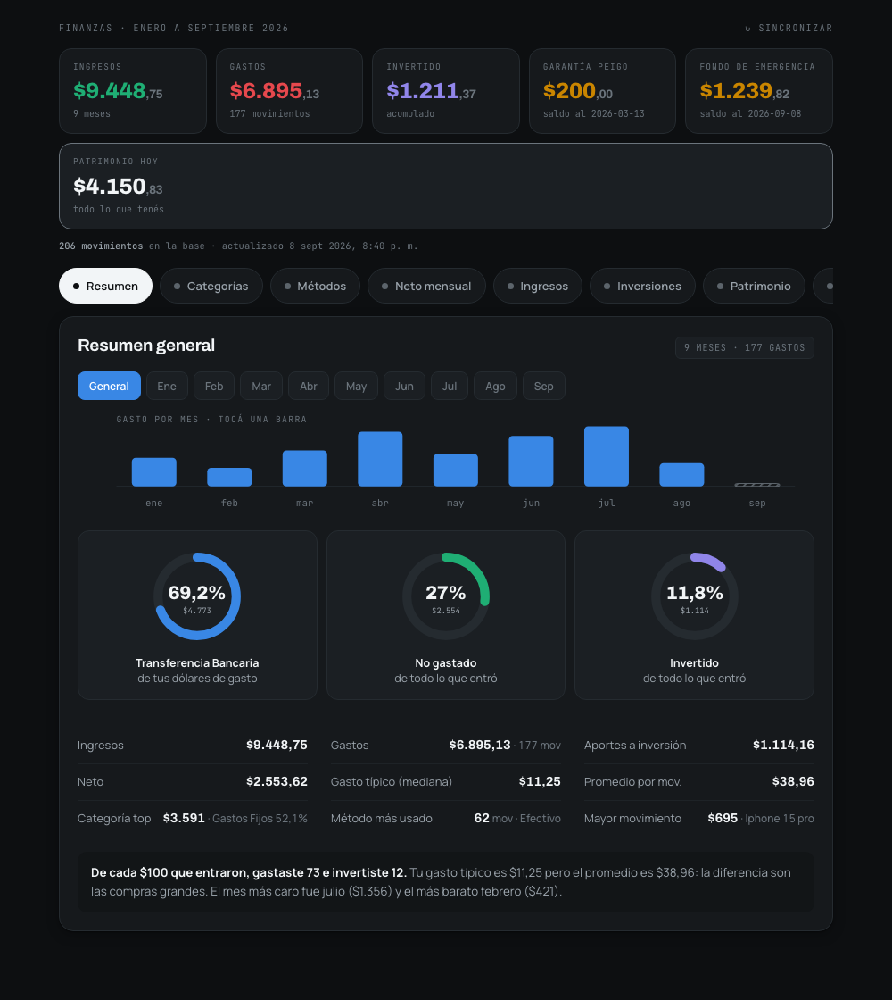
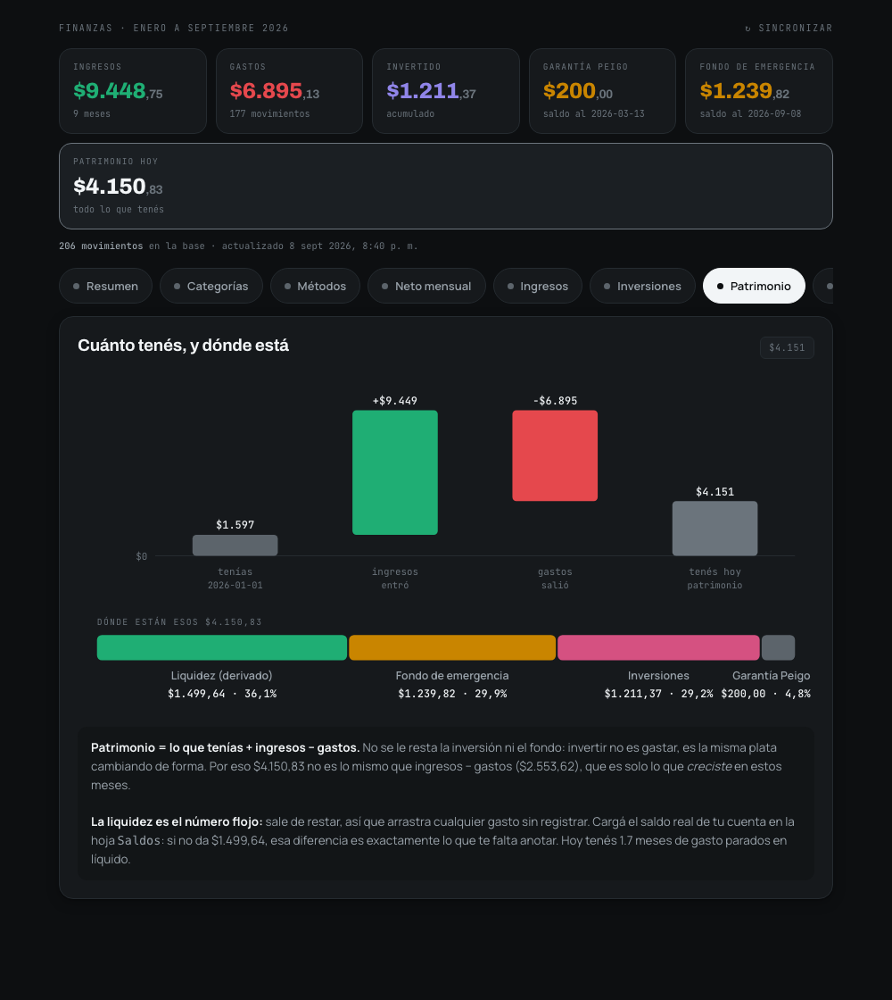
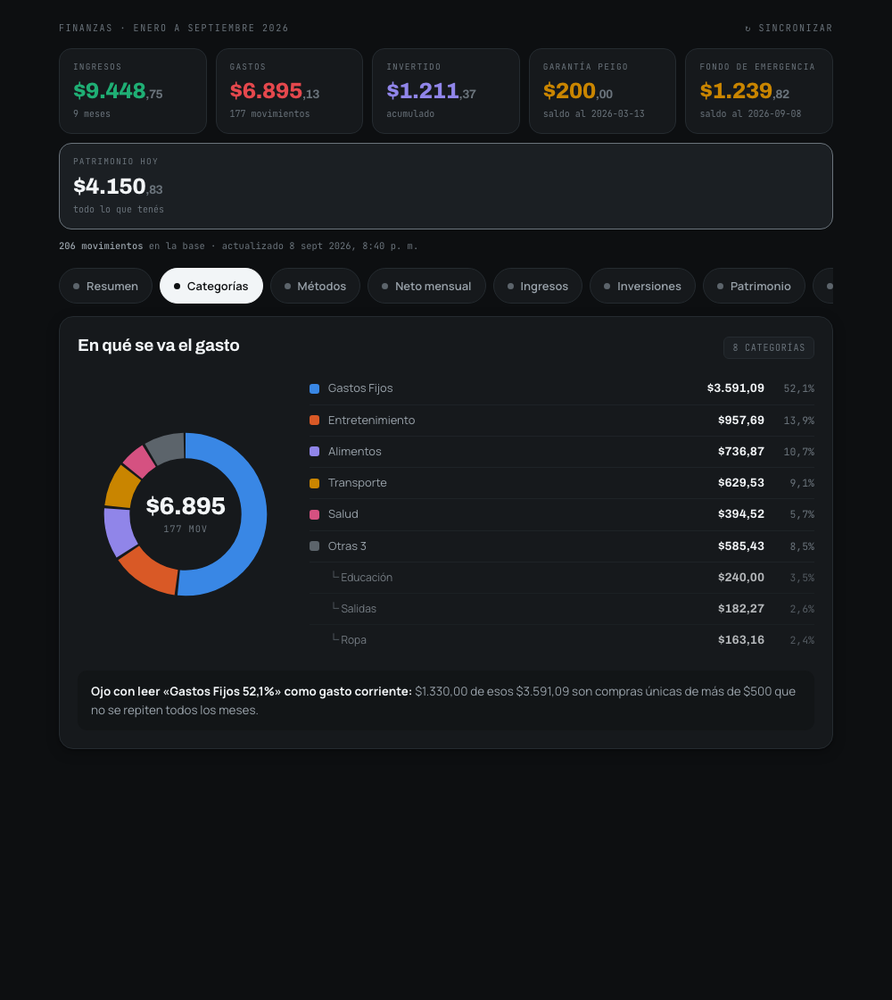
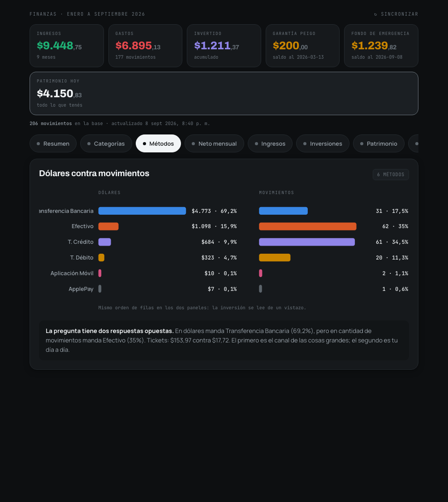
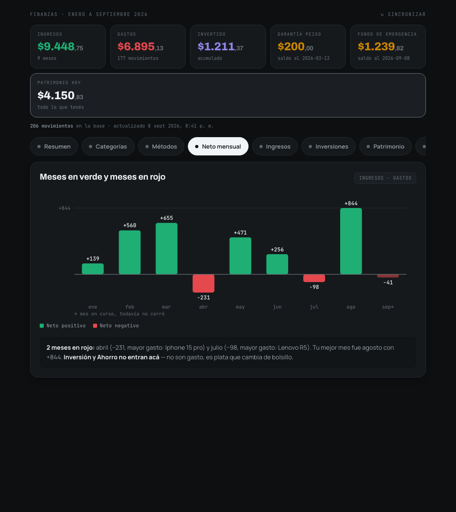

# Tracker de finanzas: Atajo → Google Sheet → RPi Zero 2W

Arquitectura: el Atajo de iOS escribe directo a un Google Sheet (fuente de verdad,
vive en la nube de Google, nunca depende de que la Pi esté prendida). La Raspberry
Pi Zero 2W sincroniza ese Sheet a una SQLite local cada cierto tiempo y sirve un
dashboard con gráficos, filtros, y una capa de preguntas en lenguaje natural.

Esto no es solo un tracker de gastos: el Atajo real registra gastos, ingresos,
inversiones y ahorro (columna `tipo`), todo en una sola hoja/tabla en vez de una
por tipo — así "balance neto" es una consulta, no un cruce entre varias tablas.

```
[Atajo iOS] --POST--> [Apps Script Web App] --appendRow--> [Google Sheet]
                                                                  |
                                                     (pull cada 15 min, solo lectura)
                                                                  v
                                                    [RPi Zero 2W: sync -> SQLite]
                                                                  |
                                                     [Express: dashboard + API + chatbot]
```

Si la Pi está apagada o sin internet: sigues registrando gastos sin problema
(van al Sheet), y puedes abrir el Sheet directo desde el celular para ver el
gráfico nativo de Google como respaldo. Cuando la Pi vuelve, se pone al día sola.

---

## El dashboard

Ocho vistas, una a la vez, con navegación por chips: no hay que scrollear para
encontrar nada. Todos los gráficos son **SVG generado desde los datos** — el
dashboard no carga ninguna librería de charts ni depende de un CDN, así que
abre igual sin internet mientras la Pi esté encendida.



El **Resumen** se puede ver general o mes a mes: los chips de arriba y las
barras del gráfico son selectores, y las tres donas, las nueve cifras y la
lectura de abajo se recalculan.

| | |
|---|---|
|  |  |
| **Patrimonio** — cascada de cómo se llegó al número de hoy, y en qué cuentas está repartido. | **Categorías** — anillo con las 6 principales y desglose completo al lado. |
|  |  |
| **Métodos** — dólares contra movimientos, en paneles separados. Suelen dar respuestas opuestas. | **Neto mensual** — barras divergentes sobre el cero: qué meses cerraron en rojo. |

Cada vista tiene su URL: `.../dashboard.html#patrimonio` abre directo esa
pestaña, y el botón Atrás del navegador funciona.

### Flujos y saldos son cosas distintas

La decisión de modelo que más afecta a lo que ves:

- **`movimientos`** guarda *flujos*: plata que se movió, con fecha. Un gasto,
  un sueldo, un aporte a inversión.
- **`saldos`** guarda *fotos*: cuánto hay en una cuenta a una fecha. El fondo
  de emergencia, el saldo con el que arrancaste.

Meter un saldo en la tabla de flujos rompe las sumas. Si tu fondo pasa de
$1.200 a $1.400 y cargás las dos fotos como movimiento, el tracker va a decir
que ahorraste $2.600 en vez de $200.

De ahí salen dos reglas que el código aplica solo:

- **Patrimonio = saldo inicial + ingresos − gastos.** La inversión *no* se
  resta: invertir no es gastar, es la misma plata cambiando de forma.
- **La liquidez es un número derivado**, no medido: sale de restarle al
  patrimonio lo que está en cuentas conocidas. Si cargás el saldo real de tu
  cuenta corriente en `Saldos` y no coincide, **esa diferencia es exactamente
  lo que te falta registrar**. Es el mejor control de calidad del tracker.

### La hoja `Saldos` (opcional)

El panel de Patrimonio necesita una segunda hoja en el mismo Google Sheet,
llamada `Saldos`, con tres columnas:

```
fecha       | cuenta              | saldo
2026-01-01  | Banco               | 1500.00
2026-01-01  | Inversiones         | 97.21
2026-09-08  | Fondo de emergencia | 1239.82
```

La fila más antigua de cada cuenta es el saldo de apertura; la más reciente es
lo que hay hoy. Si la hoja no existe el sync lo avisa una vez y sigue: todo lo
demás funciona igual, solo se deshabilita ese panel.

---

## Fase 1 — Google Sheet + Apps Script (30 min)

1. Crea un Google Sheet nuevo. Nombra la primera hoja `Movimientos` (si ya la
   creaste como `Gastos`, solo renómbrala con clic derecho en la pestaña).
2. En la fila 1, pon los encabezados exactos, en este orden (A a H):
   `id | fecha | categoria | metodo_pago | monto | nota | tipo | recibido_en`
   - `tipo` es uno de: `Gasto`, `Ingreso`, `Ahorro`, `Inversión` (quitaste
     "Transferencia" del Atajo porque no la usabas, así que aquí también
     se eliminó del validador).
3. Extensiones → Apps Script. Borra el contenido de `Code.gs` y pega el de
   `apps-script/Code.gs` de este paquete.
4. Cambia `SHARED_SECRET` por algo tuyo (una cadena random cualquiera).
5. Implementar → Nueva implementación → tipo **Aplicación web**.
   - Ejecutar como: **Yo**
   - Quién tiene acceso: **Cualquiera**
6. Copia la URL que termina en `/exec`. Esa es tu endpoint.
7. **Sobre el separador decimal:** en el dato el separador es **siempre el
   punto** (`847.26`), porque es lo único que SQLite entiende como número. Lo
   que ves con coma en la pantalla del Sheet es el locale pintando el número,
   no el dato. El dashboard formatea a `es-EC` (`$6.895,13`) al mostrar.
   Formatear es cosa del front; guardar es cosa del dato, nunca al revés.
8. Prueba con curl antes de tocar el Atajo:
   ```bash
   curl -X POST 'TU_URL_/exec' \
     -H 'Content-Type: application/json' \
     -d '{"secret":"TU_SECRETO","id":"test-1","fecha":"2026-09-07","categoria":"comida","metodo_pago":"Efectivo","monto":12.5,"nota":"prueba","tipo":"Gasto"}'
   ```
   Deberías ver `{"ok":true,"duplicate":false,...}` y una fila nueva en el Sheet.

### Ajustar el Atajo existente ("Finanzas Notion")

Orden real confirmado del Atajo, de arriba a abajo:

1. Pedir Texto con "Descripción?"
2. Pedir Número con "Monto?"
3. Reemplazar "," por "." en [Solicitar entrada]
4. Crear lista (Tipo: Ingreso, Gasto, Ahorro, Inversión — elimina "Transferencia" de esta lista) + Seleccionar en Lista
5. Crear lista (Categoría: las que ya tienes, más las que agregues — no hay lista fija que mantener sincronizada en el código, ver nota abajo) + Seleccionar en Lista
6. Crear lista (Método: Efectivo, ApplePay, Transferencia Bancaria, Tarjeta de Débito, Tarjeta de Crédito, Aplicación Móvil, Otro) + Seleccionar en Lista
7. Fecha actual
8. Texto — arma el JSON de Notion (`{"parent": {"database_id": "2dab0..."}, "properties": {...`)
9. Obtener contenido de `https://api.notion.com/v1/pages`
10. (si la tienes) Mostrar notificación

**Mantén (1) a (7) exactamente como están** — capturan todo lo que necesito,
incluido el Tipo, que ya lo preguntas.

**Borra (8) y (9)** completos: el Texto con el JSON de Notion y la llamada a
`api.notion.com`, con sus headers de autenticación.

**Agrega, entre (7) y donde borraste (8)-(9):**
1. **Formatear fecha** sobre "Fecha actual" → `yyyy-MM-dd` → variable `fecha`.
2. **Formatear fecha** (otra instancia) → `yyyyMMddHHmmss` → variable `marca_tiempo`.
3. **Número aleatorio** 1000-9999 → variable `azar`.
4. **Texto**: `marca_tiempo` + `azar` pegados → variable `id` (idempotencia:
   si el Atajo reintenta por mala señal, el mismo `id` hace que el Apps
   Script ignore el duplicado en vez de crear una fila repetida).
5. **Diccionario** con estas 8 claves:
   - `secret` → tu palabra secreta de `SHARED_SECRET`
   - `id` → variable del paso 4 de arriba
   - `fecha` → variable del paso 1 de arriba
   - `categoria` → resultado de "Seleccionar en Lista" del paso (5) original
   - `metodo_pago` → resultado de "Seleccionar en Lista" del paso (6) original
   - `monto` → resultado de "Reemplazar , por ." (paso 3 original)
   - `nota` → resultado de "Pedir Texto con Descripción?" (paso 1 original)
   - `tipo` → resultado de "Seleccionar en Lista" del paso (4) original

**Reemplaza (9)** con una nueva **Obtener contenido de URL**: tu endpoint
`/exec`, método POST, cuerpo de solicitud JSON = el Diccionario del paso 5.

**Deja (10) igual**, sigue funcionando sin cambios.

**Sobre agregar categorías nuevas**: `categoria` no está validada contra una
lista fija en el Apps Script ni en la Pi — es texto libre que se guarda tal
cual. Agrega los ítems que quieras a la "Crear lista" de categorías en el
Atajo y listo, no hay que tocar ningún archivo de este paquete. El dropdown
de categorías del dashboard (`/api/categorias`) se llena solo a partir de lo
que ya existe en tus datos, así que la categoría nueva aparece ahí en cuanto
registres el primer gasto con ella.

Y reemplazar la llamada a `api.notion.com` por:
- **Obtener contenido de URL**: tu endpoint `/exec`, método POST, cuerpo de
  solicitud JSON = el Diccionario del paso 5.

(Recomendado, ver "Mejoras" abajo): si el POST falla, guarda el registro en
una lista local del propio Atajo para reintentar después, en vez de perder
el dato.

---

## Fase 2 — Migrar el historial de Notion

Ya está hecho para tus datos reales: `movimientos-migrados.csv` (fuera de este
zip, te lo mandé aparte) tiene tus 202 filas originales de Notion, convertidas
al formato exacto de la hoja `Movimientos` (incluye la columna `tipo`). Solo
tienes que pegarlo debajo del encabezado una vez que la hoja exista.

Si más adelante necesitas repetir el proceso (por ejemplo si sigues anotando
en Notion mientras terminas de armar esto), el script que lo generó está en
este mismo paquete si me pides que te lo pase, o puedo volver a correrlo si
me mandas un export nuevo.

Deja tu base de Notion de notas/apuntes intacta — solo migras la de finanzas.

---

## Fase 3 — Raspberry Pi Zero 2W

La Zero 2W tiene 512MB de RAM y un cuádruple núcleo modesto. Esto sí importa
para las decisiones de abajo: todo corre en **un solo proceso Node**, SQLite
en vez de un motor de base de datos aparte, y nada de Docker ni de compilar
Angular/frameworks pesados directamente en la Pi.

1. Flashea Raspberry Pi OS Lite (sin escritorio — ahorra RAM) con Raspberry
   Pi Imager, habilita SSH desde el propio Imager.
2. Conéctate por SSH e instala Node LTS (usa NodeSource o `nvm`, evita el
   Node viejo de los repos de Debian).
3. Copia la carpeta `rpi/` de este paquete a `/home/rpi/expense-tracker/rpi`.
4. `cd` a esa carpeta y corre `npm install`. (`better-sqlite3` compila un
   módulo nativo — en la primera instalación puede tardar varios minutos en
   la Zero 2W, es normal.)
5. Copia `.env.example` a `.env` y rellena `SHEET_ID` y `ANTHROPIC_API_KEY`.
6. Crea la cuenta de servicio de Google:
   - Google Cloud Console → nuevo proyecto → habilita **Google Sheets API**.
   - IAM → Cuentas de servicio → crear una → genera una clave JSON.
   - Descarga ese JSON como `service-account.json` dentro de `rpi/`.
   - **Comparte el Google Sheet** con el email de la cuenta de servicio
     (termina en `...@...iam.gserviceaccount.com`), como si fuera una
     persona más, con acceso de lector.
7. Prueba el sync a mano: `npm run sync-once`. Deberías ver
   `[sync] ... N filas sincronizadas`.
8. Habilita el swap de seguridad: `bash setup-swap.sh`.
9. Instala el servicio para que arranque solo:
   ```bash
   sudo cp expense-tracker.service /etc/systemd/system/
   sudo systemctl daemon-reload
   sudo systemctl enable --now expense-tracker
   sudo systemctl status expense-tracker
   ```
10. Abre `http://IP_DE_TU_PI:3000` desde tu red local. Deberías ver el
    dashboard con tus gastos migrados.

### Acceso remoto sin abrir puertos

Instala [Tailscale](https://tailscale.com) en la Pi y en tu celular (gratis
para uso personal). Te da una IP privada que funciona desde cualquier red sin
tocar el router ni exponer la Pi a internet público.

---

## Fase 4 — Preguntas en lenguaje natural

Ya viene integrado en `server.js` vía `/api/preguntar`, usando la API de
Claude con function calling: el modelo traduce tu pregunta a un `SELECT`,
el servidor valida que sea de solo lectura antes de correrlo contra SQLite,
y el modelo redacta la respuesta a partir del resultado.

Esto es un complemento, no el mecanismo principal — los filtros por fecha
y categoría del dashboard siguen siendo el camino rápido y 100% predecible
para el día a día. La pregunta libre es para lo que no cabe en un dropdown
("¿en qué mes gasté más el año pasado?", "¿cuánto llevo en total este mes
comparado con el anterior?").

---

## Mejoras que vale la pena considerar

- **Bot de Telegram**: además del dashboard web, un bot de Telegram (API
  gratuita, muy simple) te deja preguntar "¿cuánto gasté hoy?" desde el chat
  sin abrir nada, y también sirve para que el Apps Script te avise al
  instante cuando llega un gasto grande, sin pasar por la Pi.
- **Alertas de presupuesto**: agrega una hoja `Presupuestos` en el mismo
  Sheet (categoría → monto mensual). El cron de sync puede comparar el
  gasto acumulado del mes contra ese presupuesto y mandarte un mensaje
  (Telegram o notificación push) cuando lo superas.
- **Cola offline en el Atajo**: si el POST falla (sin señal), que el Atajo
  guarde el JSON en un archivo de texto local y tengas un segundo Atajo
  "Sincronizar pendientes" que reintente esas filas cuando vuelvas a tener
  señal. Barato de hacer y evita perder un gasto por mala cobertura.
- **La SQLite de la Pi es desechable, trátala así**: como el Sheet es la
  fuente de verdad, si la tarjeta SD se corrompe (el modo de falla más común
  en proyectos de RPi) no pierdes nada — flasheas de nuevo, copias `rpi/`,
  corres `npm run sync-once` y en segundos tienes todo el historial de
  vuelta. Vale la pena probar ese escenario una vez a propósito para
  confirmar que funciona, no asumirlo.
- **Backup del propio Sheet**: aunque vive en Google, agrega una exportación
  automática mensual a CSV (Apps Script con un trigger de tiempo) a tu
  Google Drive, por si algún día quieres independencia total de Google Sheets
  como origen.
- **Presupuesto por categoría en el dashboard**: barras de progreso
  (gastado vs. presupuestado) en vez de solo el total — es lo primero que
  se pregunta la gente al abrir un tracker de gastos.
