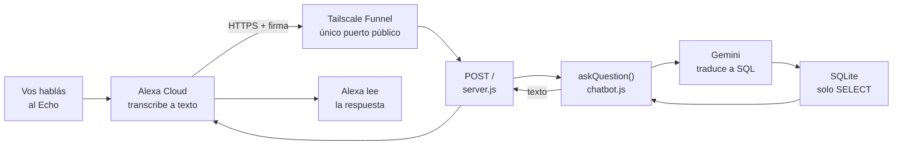

# Fase 5 — Preguntas por voz con Alexa

Un Custom Skill de Alexa llamado **finanzas** que habla con el mismo chatbot
de Gemini que ya vive en la Pi. Cero lógica de IA nueva: Alexa transcribe la
voz, la pregunta cruda viaja al endpoint, y `askQuestion()` de `chatbot.js`
hace exactamente lo mismo que hace para el dashboard.

Sin AWS, sin Lambda, sin abrir puertos en el router.

## Cómo se usa

```
Vos:    Alexa, abre finanzas
Alexa:  Hola. Empezá con "dime" y tu pregunta. Por ejemplo: dime cuánto gasté en total.
Vos:    dime cuánto gasté en alimentos
Alexa:  Gastaste $412,50 en Alimentos. ¿Algo más? Empezá con "dime", o decí "para" para terminar.
Vos:    para
```

La palabra de arranque (`dime`, `pregunta`, `quiero saber`) **no es opcional** —
ver el gotcha del carrier phrase más abajo.

## Arquitectura



## Qué queda expuesto y qué no

Tailscale Funnel publica **una sola ruta**. Todo el resto sigue accesible
únicamente desde dispositivos de tu propia red Tailscale, igual que antes:

| Ruta | Alcance | Autenticación |
|---|---|---|
| `POST /` | Internet (vía Funnel) | Firma criptográfica de Alexa + Skill ID |
| `POST /api/alexa` | Solo tailnet | `ALEXA_SHARED_SECRET` en un header |
| `/api/dashboard`, `/api/preguntar`, `/api/gastos`, `/api/sync`, `dashboard.html` | Solo tailnet | Ninguna (red privada) |

Que sean dos rutas con dos autenticaciones distintas no es duplicación: son
dos superficies con amenazas distintas. La pública no puede usar un secreto
compartido (ver gotcha del header), y la interna existe para poder probar con
`curl` sin fabricar una firma de Alexa.

Aunque el endpoint es público, sigue siendo de **solo lectura**: mantiene la
validación de `chatbot.js` que exige que el SQL generado por el modelo sea un
`SELECT` contra `movimientos`.

## Configuración

### 1. Variables en el `.env` de la Pi

```bash
ALEXA_SHARED_SECRET=   # string propio, generado con: openssl rand -hex 24
ALEXA_SKILL_ID=        # amzn1.ask.skill.xxxxxxxx-... , lo da el Developer Console
```

`ALEXA_SKILL_ID` no es un secreto (viaja en cada request de Alexa), pero se
compara para rechazar requests firmadas válidamente que sean para *otra* skill.

### 2. Tailscale Funnel

Funnel se habilita una vez por tailnet, desde el admin console:
**Access controls → JSON editor**, agregando el `nodeAttrs` que propone el
botón "Add Funnel to policy". Después, en la Pi:

```bash
sudo tailscale funnel --bg --set-path=/api/alexa 3000
tailscale funnel status
```

El `--bg` es obligatorio: sin él, el proxy muere al cerrar la sesión SSH.

### 3. El Custom Skill

En `developer.amazon.com/alexa/console/ask`, skill nueva:

- **Modelo**: Custom. **Hosting**: Provision your own (no Alexa-hosted).
- **Interaction Model → JSON Editor**: pegar `alexa-interaction-model.json`
  (en este mismo directorio), después *Save Model* y *Build Model*.
- **Endpoint**: HTTPS, apuntando a `https://<tu-nodo>.<tu-tailnet>.ts.net/api/alexa`,
  con el tipo de certificado *"My development endpoint has a certificate from a
  trusted certificate authority"* — el cert de Funnel es Let's Encrypt, que
  califica.

No hace falta publicar la skill: en modo desarrollo ya funciona en tu Echo,
privada a tu cuenta.

## Gotchas

Cada uno de estos costó una sesión de debugging. Están acá para no repetirla.

### `--set-path` de Funnel pela el prefijo

`tailscale funnel --set-path=/api/alexa 3000` publica la URL `.../api/alexa`,
pero al proxyear al backend **saca el prefijo**: a Express le llega `POST /`,
no `POST /api/alexa`. Por eso el handler está montado en las dos rutas, y la
que realmente atiende a Alexa es `/`.

Síntoma: `404 Cannot POST /` con la URL pública, mientras el endpoint anda
perfecto desde adentro del tailnet.

### La consola de Alexa no permite headers custom

La pantalla de Endpoint solo acepta URL y tipo de certificado. **No hay forma
de que Alexa mande un header propio**, así que el esquema "secreto compartido
en un header" es inaplicable para el endpoint público.

El mecanismo oficial es verificar la firma que Alexa incluye en cada request
(`SignatureCertChainUrl` + la firma), que prueba criptográficamente que el
request salió de Amazon. Lo hace la librería `alexa-verifier`.

### La firma va en `Signature-256`, no en `Signature`

Amazon manda las dos: `Signature` (SHA-1, deprecado) y `Signature-256`
(SHA-256). `alexa-verifier` v4 verifica con RSA-SHA256, así que pasarle el
header `Signature` da **`invalid signature` con el certificado validando
perfecto** — un síntoma que despista mucho, porque todo lo demás está bien.

### No se le puede responder a `SessionEndedRequest`

La doc es explícita: *"Your skill cannot return a response to
SessionEndedRequest"*. Devolverle voz hace que Alexa lo cuente como
`INVALID_RESPONSE` y aparezca el "la skill no ha contestado". Hay que
contestar `200` con body vacío.

Ese request es además la mejor herramienta de diagnóstico que hay: trae
`reason` (`ERROR`, `USER_INITIATED`, `EXCEEDED_MAX_REPROMPTS`) y, si fue
error, `error.type` (`INVALID_RESPONSE`, `ENDPOINT_TIMEOUT`, ...). Dice
exactamente por qué se cortó.

### Sin `reprompt`, la sesión se cierra sola

Cuando se devuelve `shouldEndSession: false` hay que mandar también un
`reprompt`. Si no, el usuario que tarda un segundo de más en hablar se queda
sin sesión, en silencio y sin error visible.

### Los samples exigen una palabra de arranque

Alexa **rechaza** un sample que sea solo el slot (`"{query}"`) cuando el slot
es `AMAZON.SearchQuery`: *"Sample utterance must include a carrier phrase"*.
Por eso todos los samples son `dime {query}`, `pregunta {query}`,
`quiero saber {query}`.

Consecuencia práctica: con la sesión abierta, una pregunta pelada
("cuánto gasté en total") no matchea ningún intent, y Alexa cierra con
`EXCEEDED_MAX_REPROMPTS`. Por eso el saludo dicta la fórmula en vez de
preguntar abierto.

### El simulador depende del marketplace de tu cuenta

Si tu cuenta de Amazon es de otro país que el locale de la skill, el
simulador contesta *"Tu cuenta de Amazon está vinculada a..."* y nunca llega a
tu endpoint. Se resuelve agregando un locale que tu cuenta sí soporte
(por ejemplo Spanish (MX)) desde el selector de idioma del Build.

Ojo también con probar sin invocar la skill: si decís la pregunta sin abrir
"finanzas" primero, Alexa la rutea a un built-in de Amazon y contesta
cualquier cosa (típicamente algo sobre tus pedidos).

### `better-sqlite3` tiene que ser v13+ en Node 24

Con `better-sqlite3` 11.x sobre Node 24, el proceso moría con `SIGABRT`:

```
Assertion failed: (env) != nullptr
node::RemoveEnvironmentCleanupHook(...)
Statement::~Statement() [better_sqlite3.node]
```

No era determinista: crasheaba en la primera consulta al chatbot cuando el
proceso llevaba rato arriba, y andaba bien recién reiniciado. systemd lo
levantaba en 5 segundos, así que desde el dashboard parecía "a veces falla";
desde Alexa es un 502 y un "la skill no ha contestado".

v13 es la primera versión sobre N-API, que es ABI-estable y no usa ese
mecanismo de cleanup hooks. Beneficio extra: ya no hace falta recompilar el
módulo nativo cada vez que cambia la versión de Node.

## Diagnóstico

Alexa no dice nunca qué falló de verdad; el log de la Pi sí:

```bash
journalctl -u expense-tracker -f
```

Preguntas útiles y dónde se contestan:

| Síntoma | Qué mirar |
|---|---|
| "La skill no ha contestado" | ¿Llegó el POST al log? Si no llegó, es Funnel/red. Si llegó, mirar `SessionEnded — reason`. |
| Responde pero se corta la sesión | `reason: EXCEEDED_MAX_REPROMPTS` → la frase no matcheó ningún sample. |
| `invalid signature` | Header equivocado (`Signature` en vez de `Signature-256`) o `ALEXA_SKILL_ID` mal. |
| Números que no cuadran | Mirar el campo `sql` de `/api/preguntar` — el modelo puede estar filtrando por una categoría que no existe. |

Para probar el endpoint sin Alexa de por medio, desde dentro del tailnet:

```bash
curl -s -X POST http://localhost:3000/api/alexa \
  -H "Content-Type: application/json" \
  -H "x-alexa-secret: $ALEXA_SHARED_SECRET" \
  -d '{"request":{"intent":{"slots":{"query":{"value":"cuanto gaste en total"}}}}}'
```

Alexa corta a los ~8 segundos. Cada pregunta hace dos llamadas a Gemini
(generar el SQL y redactar la respuesta); en la Zero 2W eso da entre 1 y 3
segundos, así que hay margen, pero es el primer número a mirar si algún día
empieza a fallar por tiempo.
